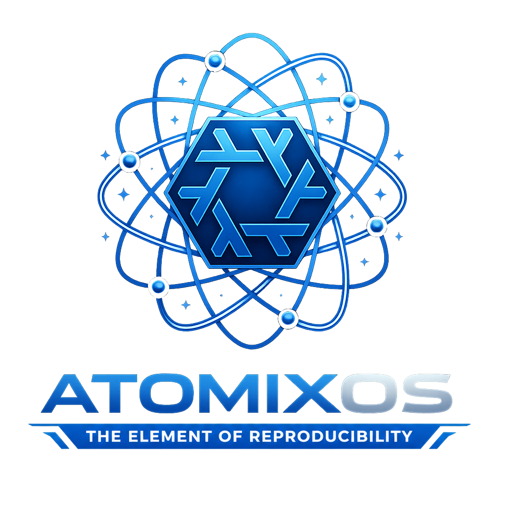
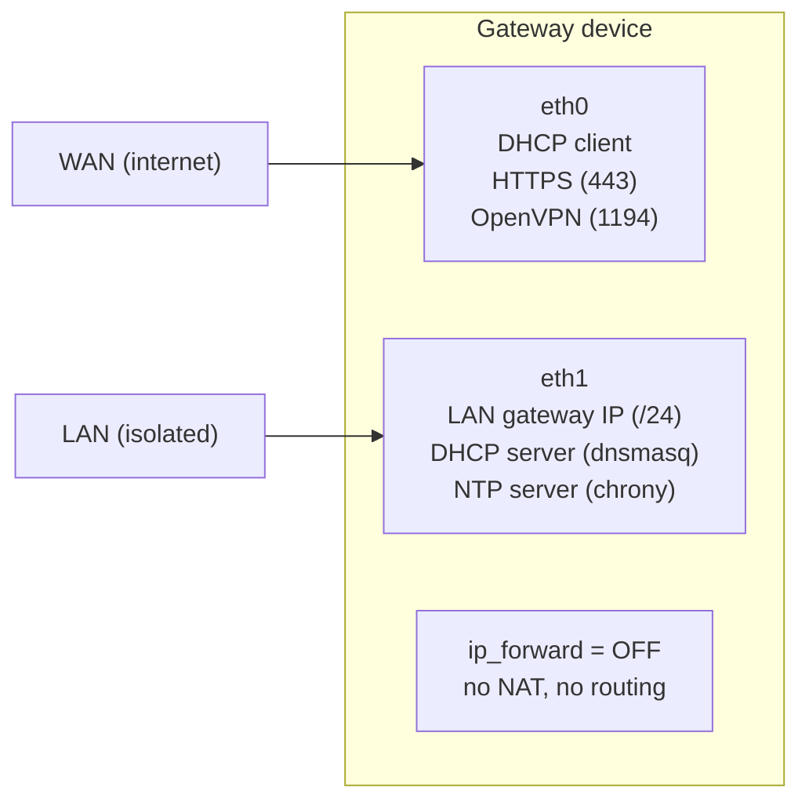

<!-- rumdl-disable-file MD041 -->

<p align="center">  </p>

AtomixOS is a secure, reproducible operating system for single-board computers, built on NixOS with atomic A/B OTA
updates, automatic rollback, and a container-based application deployment model.

<!-- BEGIN mktoc {"min_depth": 2, "max_depth": 4, "wrap_in_details": false} -->

- [Supported Boards](#supported-boards)
- [Features](#features)
- [Architecture](#architecture)
  - [eMMC partition layout (16 GB)](#emmc-partition-layout-16-gb)
  - [Network topology](#network-topology)
  - [Update and rollback flow](#update-and-rollback-flow)
  - [Squashfs rootfs](#squashfs-rootfs)
  - [Authentication (EN18031)](#authentication-en18031)
- [LAN Range Configuration](#lan-range-configuration)
- [Project structure](#project-structure)
- [Building](#building)
  - [With mise (recommended)](#with-mise-recommended)
- [Running E2E Tests](#running-e2e-tests)
  - [Run all tests](#run-all-tests)
  - [Run individual tests](#run-individual-tests)
  - [Test performance: macOS apple-virt vs Linux TCG](#test-performance-macos-apple-virt-vs-linux-tcg)
  - [Interactive debugging](#interactive-debugging)
  - [Running tests directly with Nix](#running-tests-directly-with-nix)
- [Provisioning](#provisioning)
- [mise Task Reference](#mise-task-reference)
- [Flake outputs](#flake-outputs)
- [Versioned Image Naming](#versioned-image-naming)
- [Status](#status)
<!-- END mktoc -->

## Supported Boards

- Rock64 (RK3328, aarch64)

## Features

- **Atomic OTA updates** -- installs to the inactive slot pair while the active slot stays online
- **Automatic rollback** -- uses U-Boot boot-count fallback after repeated failed boots
- **Hardware watchdog (currently disabled)** -- integration is implemented and tested in QEMU;
  Rock64 runtime enablement is pending boot-stability validation
- **Local health-check confirmation** -- commits new slots only after service and manifest container checks pass
- **Signed RAUC bundles** -- builds reproducible, signed `.raucb` artifacts from the flake
- **Network isolation boundary** -- keeps LAN clients off the internet; only explicit application-layer proxying is
  allowed
- **EN18031-ready authentication** -- ships without default credentials; per-device credentials are provisioned

## Architecture

### eMMC partition layout (16 GB)

```text
Offset     Size       Content          Filesystem
0          16 MB      U-Boot           raw (idbloader + u-boot.itb)
16 MB      128 MB     boot slot A      vfat (kernel + initrd + DTB + boot.scr)
144 MB     1 GB       rootfs slot A    squashfs (zstd, 1 MB block)
1168 MB    128 MB     boot slot B      vfat (created on first boot)
1296 MB    1 GB       rootfs slot B    squashfs (created on first boot)
2308 MB    ~13.3 GB   /data            f2fs (created on first boot; containers, state, logs)
```

### Network topology



LAN devices get DHCP and NTP but have zero internet access. Application-layer proxying (Traefik, running as a container)
selectively bridges WAN and LAN with authentication.

### Update and rollback flow

```text
1. os-upgrade.service polls update server for new .raucb bundle
2. rauc install writes boot + rootfs to the INACTIVE slot pair
3. RAUC sets U-Boot env: BOOT_ORDER=B A, BOOT_B_LEFT=3
4. Device reboots into new slot
5. U-Boot decrements BOOT_B_LEFT on each boot attempt
6. os-verification.service runs health checks:
   - eth0 has WAN address, eth1 has the configured LAN gateway IP
   - dnsmasq, chronyd running
   - sustained 60s stability check
7a. All pass  → rauc status mark-good (slot committed)
7b. Any fail  → exit non-zero, boot-count continues to decrement
8. After 3 failed boots → U-Boot falls back to previous good slot
```

The hardware watchdog integration is implemented, but runtime enforcement is currently disabled
during development on Rock64 until boot stability is fully validated.

### Squashfs rootfs

The read-only root filesystem contains the full NixOS system closure:

- Stripped Linux 6.19 kernel (RK3328 drivers built-in, WiFi/BT as modules)
- systemd, podman, OpenVPN, openssh, chrony, dnsmasq, nftables, RAUC

### Authentication (EN18031)

The image ships with no embedded credentials. During provisioning:

- `/data/config/ssh-authorized-keys/admin` -- operator's SSH public key
- `/data/config/nixstasis/` -- planned persistent state for Nixstasis enrollment and agent credentials

Normal operator access is SSH-key-only. On Rock64, `_RUT_OH_=1` in U-Boot
enables a deterministic physical serial-root recovery path on the next boot.

Remote management is intended to flow through Nixstasis using device-approved enrollment, reverse tunnels, and short-lived
SSH credentials. The device itself keeps SSH-based LAN recovery and local gateway services.

## LAN Range Configuration

Use the `mise` helper task to update LAN settings across all required files in one command.

```sh
mise run config:lan-range --gateway-cidr 10.50.0.1/24 --dhcp-start 10.50.0.10 --dhcp-end 10.50.0.254
```

This updates:

- `modules/networking.nix` (`eth1` static address)
- `modules/lan-gateway.nix` (DHCP pool, DHCP options, chrony allow subnet)
- `scripts/os-verification.sh` (expected `eth1` IP)

After changing the range, rebuild:

```sh
mise run check
mise run build
```

## Project structure

For a detailed project layout overview, see
[`docs/src/reference/project-structure.md`](docs/src/reference/project-structure.md).

It covers the main modules, scripts, tasks, tests, and documentation entry
points in the repo.

## Building

Builds require an aarch64-linux system (native or cross). All outputs target `aarch64-linux`.

### With mise (recommended)

```sh
# Install tools and hooks
mise install

# Check the flake evaluates cleanly
mise run check

# Build individual artifacts
mise run build:squashfs        # result-squashfs/
mise run build:rauc-bundle     # result-rauc-bundle/
mise run build:boot-script     # result-boot-script/
mise run build                 # .gcroots/images/image.1/

# Build everything
mise run build

# Build via Lima VM (when nix-darwin linux-builder is not available)
mise run build -- --lima
mise run build -- --lima --vm my-builder
```

## Running E2E Tests

The core `mise run e2e` suite runs 9 NixOS VM integration tests for the RAUC lifecycle and network behavior. The flake
also exposes additional provisioning and forensics checks directly under `checks.*`. Tests run on both Linux (TCG
software emulation) and macOS (Apple Virtualization Framework). The mise task wrappers auto-detect the platform and
select the correct flake output (`aarch64-linux` or `aarch64-darwin`).

### Run all tests

```sh
mise run e2e

# Run all tests inside a Lima VM
mise run e2e --lima
mise run e2e --lima --vm my-builder
```

### Run individual tests

```sh
mise run e2e:rauc-slots          # RAUC sees all 4 A/B slots after boot
mise run e2e:rauc-update         # Bundle install writes to inactive slot pair, slot switches A→B
mise run e2e:rauc-rollback       # Install to B, mark bad, verify rollback to A
mise run e2e:rauc-confirm        # os-verification health checks pass, slot marked good (~3 min)
mise run e2e:rauc-power-loss     # Crash VM mid-install, verify slot A intact after reboot
mise run e2e:rauc-watchdog       # Freeze systemd to trigger watchdog, verify boot-count rollback
mise run e2e:firewall            # 2-node test: WAN allows HTTPS/VPN, LAN allows SSH/DHCP/NTP
mise run e2e:network-isolation   # 2-node test: LAN gets DHCP/NTP, cannot reach WAN
mise run e2e:ssh-wan-toggle      # Flag file enables/disables SSH on WAN via nftables reload

# Run an individual test inside Lima
mise run e2e:rauc-slots --lima
```

### Test performance: macOS apple-virt vs Linux TCG

On macOS, the nix-darwin `linux-builder` builds the NixOS test closures and the test driver runs QEMU natively on the
Mac host using Apple Virtualization Framework (`apple-virt`) for hardware acceleration. On Linux (e.g. Lima VM), tests
run under TCG software emulation without KVM. Measured wall-clock times:

| Test                | macOS (apple-virt) | Linux (TCG, Lima 4 GB) | Speedup   |
|---------------------|--------------------|------------------------|-----------|
| `rauc-slots`        | 34s                | 132s                   | 3.9x      |
| `rauc-update`       | 25s                | 137s                   | 5.5x      |
| `rauc-rollback`     | 22s                | 120s                   | 5.5x      |
| `rauc-confirm`      | 95s                | 171s                   | 1.8x      |
| `rauc-power-loss`   | 46s                | 184s                   | 4.0x      |
| `rauc-watchdog`     | 57s                | 315s                   | 5.5x      |
| `firewall`          | 65s                | 205s                   | 3.2x      |
| `network-isolation` | 68s                | --                     | --        |
| `ssh-wan-toggle`    | 35s                | --                     | --        |
| **Total**           | **~7.5 min**       | **~21 min** (7 tests)  | **~3.7x** |

The `rauc-confirm` test has the smallest speedup because most of its runtime is a fixed 60s sustained health check
timer. For CPU-bound tests (boot, install, rollback), apple-virt delivers a consistent 4-5x improvement over TCG.

### Interactive debugging

Launch an interactive QEMU VM with a Python REPL for hands-on debugging:

```sh
# Debug the default test (rauc-slots)
mise run e2e:debug

# Debug a specific test
mise run e2e:debug -t update
mise run e2e:debug -t confirm
mise run e2e:debug -t watchdog

# Keep VM state between runs
mise run e2e:debug -t slots --keep
```

Available test short names: `slots`, `update`, `rollback`, `confirm`, `power-loss`, `watchdog`, `firewall`, `net-iso`,
`ssh-toggle`.

Inside the REPL:

```python
gateway.start()                          # boot the VM
gateway.wait_for_unit("multi-user.target")
gateway.succeed("rauc status")           # run a command
gateway.shell_interact()                 # drop into a root shell
gateway.screenshot("name")              # save a screenshot
# Ctrl+D to exit
```

### Running tests directly with Nix

```sh
# Linux
nix build .#checks.aarch64-linux.rauc-slots --no-link -L

# macOS (requires nix-darwin with linux-builder enabled)
nix build .#checks.aarch64-darwin.rauc-slots --no-link -L

# When evaluating local Darwin checks that depend on nix/tests/rauc-qemu-config.nix,
# prefer a path flake ref so local files are visible even if they are untracked.
nix build "path:$PWD#checks.aarch64-darwin.rauc-slots" --no-link -L
```

## Provisioning

Build an `.img` file that can be written to eMMC (or SD card):

```sh
mise run build

# Flash to a disk device (eMMC module via USB/SD adapter)
mise run flash /dev/disk4          # macOS — auto-detects image, uses raw device for speed
mise run flash -i custom.img /dev/disk4   # specify image explicitly
mise run flash -y /dev/mmcblk0     # Linux — skip confirmation prompt
```

The image includes U-Boot plus slot A (`boot-a` + `rootfs-a`). It leaves the remaining eMMC space unallocated so initrd
`systemd-repart` can create slot B (`boot-b` + `rootfs-b`) and `/data` on first boot before the live system mounts it.

Recovery mode: hold the reset button before power-on and keep holding for
5 seconds. U-Boot will expose the on-board eMMC as
a USB mass storage device over the Rock64 OTG USB port so you can reflash it directly from a host machine.

## mise Task Reference

All tasks are run with `mise run <task>`. Run `mise tasks` to list them.

| Task                    | Description                                                 |
|-------------------------|-------------------------------------------------------------|
| `check`                 | Verify flake evaluates cleanly (`nix flake check`)          |
| **Build**               |                                                             |
| `build`                 | Build and retain image artifacts under `.gcroots/`          |
| `build:squashfs`        | Build squashfs rootfs → `result-squashfs/`                  |
| `build:rauc-bundle`     | Build signed RAUC bundle → `result-rauc-bundle/`            |
| `build:boot-script`     | Build U-Boot boot script → `result-boot-script/`            |
|                         | Optional `-o <path>` copies the latest `.img` to a path     |
|                         | All `build:*` tasks accept `--lima` and `--vm <name>`       |
| **E2E Tests**           |                                                             |
| `e2e`                   | Run the core 9-task E2E suite sequentially                  |
| `e2e:rauc-slots`        | RAUC slot detection after boot                              |
| `e2e:rauc-update`       | Bundle install + slot switch A→B                            |
| `e2e:rauc-rollback`     | Install → mark bad → rollback to previous slot              |
| `e2e:rauc-confirm`      | os-verification health check → mark-good (~3 min)           |
| `e2e:rauc-power-loss`   | Crash mid-install, verify recovery                          |
| `e2e:rauc-watchdog`     | Watchdog + boot-count rollback                              |
| `e2e:firewall`          | WAN/LAN/VPN port allow/deny (2-node VLAN)                   |
| `e2e:network-isolation` | DHCP/NTP/WAN isolation (2-node VLAN)                        |
| `e2e:ssh-wan-toggle`    | SSH-on-WAN flag enable/disable                              |
| `e2e:debug`             | Interactive QEMU VM for debugging (`-t <test>`, `--keep`)   |
| **Provisioning**        |                                                             |
| `flash`                 | Flash image to disk device with dd + progress (macOS/Linux) |
| **Configuration**       |                                                             |
| `config:lan-range`      | Update LAN gateway/DHCP range across all config files       |
| **Documentation**       |                                                             |
| `docs:build`            | Build the documentation site (mdBook) → `book/`             |
| `docs:serve`            | Serve the documentation site locally with hot-reload        |

## Flake outputs

| Output                               | Description                                              |
|--------------------------------------|----------------------------------------------------------|
| `nixosConfigurations.rock64`         | Real hardware NixOS system                               |
| `nixosConfigurations.rock64-qemu`    | QEMU aarch64-virt testing target                         |
| `packages.aarch64-linux.squashfs`    | Compressed squashfs root filesystem                      |
| `packages.aarch64-linux.rauc-bundle` | Signed multi-slot `.raucb` bundle                        |
| `packages.aarch64-linux.boot-script` | Compiled U-Boot `boot.scr`                               |
| `packages.aarch64-linux.image`       | Flashable eMMC disk image (U-Boot + boot-a + rootfs-a)   |
| `apps.aarch64-linux.rock64-qemu-vm`  | QEMU VM runner                                           |
| `checks.aarch64-linux.*`             | Full VM test suite from `nix/tests/`                     |
| `checks.aarch64-darwin.*`            | Same VM test suite, run natively on macOS via apple-virt |
| `devShells.*.default`                | Development shell with mdBook                            |

## Versioned Image Naming

The flashable image filename includes the pinned NixOS release series from your flake lock.

- Current pinned input: `nixpkgs.url = "github:NixOS/nixpkgs/nixos-25.11"`
- Output image name pattern: `atomixos-<series>.img` (for example, `atomixos-25.11.img`)
- Source of truth: `flake.nix` nixpkgs input ref

When you move to a new series (for example `nixos-26.05`), update `flake.nix`/`flake.lock` and rebuild. The image name
updates automatically everywhere it is produced.

## Status

Implementation is in progress. **99 of 116 tasks complete (85%)**. All core implementation, E2E integration tests, and
software-verifiable tasks are done. Hardware bring-up is underway — NixOS boots to login prompt on Rock64 via serial
console. The remaining 17 tasks require physical hardware testing or network access for container image pulls:

- **Hardware verification (15 tasks)** — require a physical Rock64 board (NIC naming, DHCP/NTP on real
  network, RAUC on-device, provisioning boot, Cockpit SSH bridge, credential verification)
- **Integration tests needing containers (2 tasks)** — remaining hardware/runtime validation tied to real
  provisioned workloads and on-device confirmation behavior

See `openspec/changes/rock64-ab-image/tasks.md` for the full task breakdown.
