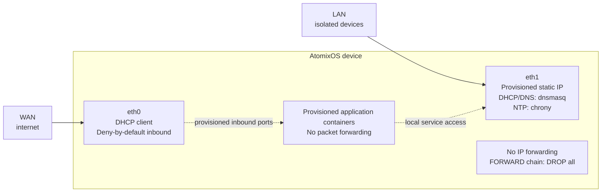

# Network Topology

Each AtomixOS device can use two Ethernet interfaces to keep LAN-side services isolated from WAN-side management and
application ingress.

## Interface Roles



## WAN Interface (eth0)

- Mapped to the onboard RK3328 GMAC via systemd `.link` file (platform path `platform-ff540000.ethernet`)
- DHCP v4 client via systemd-networkd
- Uses DHCP-provided DNS servers
- Firewall drops new inbound traffic by default
- Provisioned firewall state may open application or VPN ports from `/data/config/firewall-inbound.json`

## LAN Interface (eth1)

- USB Ethernet adapter (any supported chipset: r8152, ax88179, cdc_ether)
- Static IP: provisioned LAN gateway, falling back to `172.20.30.1/24`
- Runs dnsmasq DHCP server from the provisioned range, with fallback `172.20.30.10` -- `172.20.30.254`
- Runs chrony NTP server for the provisioned LAN subnet, with fallback `172.20.30.0/24`
- Runs gateway-local DNS only: dnsmasq serves local names on `53` and does not forward upstream

## Isolation Model

IP forwarding is explicitly disabled at the kernel level:

```nix
boot.kernel.sysctl = {
  "net.ipv4.ip_forward" = 0;
  "net.ipv6.conf.all.forwarding" = 0;
};
```

The nftables `FORWARD` chain has a `drop` policy with no exceptions. LAN devices get DHCP, DNS, NTP, SSH, and first-boot
bootstrap access on eth1, but no packet-level internet routing. WAN application or VPN exposure is created only from
provisioned firewall state.

## NIC Naming

Deterministic interface naming uses systemd `.link` files rather than udev rules:

| Link File        | Match                                            | Name                                       |
|------------------|--------------------------------------------------|--------------------------------------------|
| `10-onboard-eth` | Platform path `platform-ff540000.ethernet`       | `eth0`                                     |
| `20-usb-eth`     | USB Ethernet drivers (r8152, ax88179, cdc_ether) | enabled as modules in Rock64 kernel config |
| WiFi             | Unsupported until hardware selection             | not part of current Rock64 image           |

The onboard Ethernet is always `eth0` regardless of USB device enumeration order. USB Ethernet adapters receive
kernel-assigned names (e.g., `eth1`, `eth2`).

## Firewall Summary

| Interface  | Direction | Allowed Ports                                        |
|------------|-----------|------------------------------------------------------|
| eth0 (WAN) | Inbound   | provisioned firewall ports only                      |
| eth0 (WAN) | Inbound   | TCP 22 (SSH) -- only with flag file                  |
| eth1 (LAN) | Inbound   | UDP 53, UDP 67-68, UDP 123, TCP 22, TCP 53, TCP 8080 |
| tun0 (VPN) | Inbound   | TCP 22 (SSH)                                         |
| any        | Forward   | DROP (no exceptions)                                 |

Provisioned WAN ports come from `/data/config/firewall-inbound.json`. SSH on WAN is controlled by the presence of
`/data/config/ssh-wan-enabled`. See the [Firewall module](../code-reference/modules.md#firewallnix) for implementation
details.
