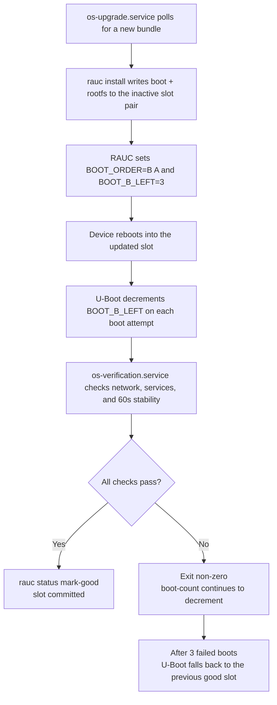

# Update & Rollback Flow

AtomixOS uses RAUC for A/B slot management combined with U-Boot boot-count logic and watchdog integration for automatic
recovery from failed updates.

## Normal Update Cycle

## Boot-Count Mechanism

U-Boot maintains three environment variables for slot selection:

| Variable      | Purpose                            | Example |
|---------------|------------------------------------|---------|
| `BOOT_ORDER`  | Slot priority (first = preferred)  | `"A B"` |
| `BOOT_A_LEFT` | Remaining boot attempts for slot A | `3`     |
| `BOOT_B_LEFT` | Remaining boot attempts for slot B | `3`     |

On each boot, the `boot.scr` script:

1. Reads `BOOT_ORDER` to determine which slot to try first
2. Checks if the preferred slot has attempts remaining (`BOOT_x_LEFT > 0`)
3. Decrements the counter and saves the environment (`saveenv`)
4. Loads kernel, initrd, and DTB from that slot's boot partition
5. Sets `root=PARTLABEL=rootfs-a` (or `rootfs-b`) and boots

If a slot's counter reaches 0, it is skipped and the next slot in `BOOT_ORDER` is tried. This ensures automatic rollback
after 3 consecutive boot failures.

## Health Check Details

The `os-verification.service` performs these checks before committing a slot:

1. **Service checks**: dnsmasq and chronyd must be active
2. **Network checks**: eth0 must have a WAN IP; eth1 must have the expected LAN gateway IP
3. **Sustained check**: all above conditions must hold for 60 seconds (checked every 5 seconds) to catch restart loops

Only after all checks pass does the service run `rauc status mark-good`, which resets the boot counter and commits the
slot.

## First Boot Exception

On initial device provisioning, the `first-boot.service` handles this by
unconditionally marking the slot as good (no network dependency) and writing a sentinel file
(`/data/.completed_first_boot`). After this, all subsequent boots use the full health-check path.

## Watchdog Integration (currently disabled on Rock64 during development)

The RK3328 hardware watchdog (`dw_wdt`) integration is implemented with these target settings:

- **Runtime watchdog**: 30 seconds -- if systemd hangs, the device reboots
- **Reboot watchdog**: 10 minutes -- if a reboot hangs, the watchdog forces a hard reset

When enabled, both scenarios feed into the boot-count rollback path: the reboot increments
the failure count, and after 3
failures the previous slot is restored.

## Update Polling

The `os-upgrade.service` runs on a systemd timer:

- First check: 5 minutes after boot
- Subsequent checks: every 1 hour (configurable)
- Random delay: up to 10 minutes (prevents thundering herd across fleet)

The service queries the update server with the device's MAC address and current version. If a newer bundle is available,
it downloads to `/data`, installs via `rauc install`, and reboots. The architecture is designed to be swappable with
hawkBit for server-push updates.
