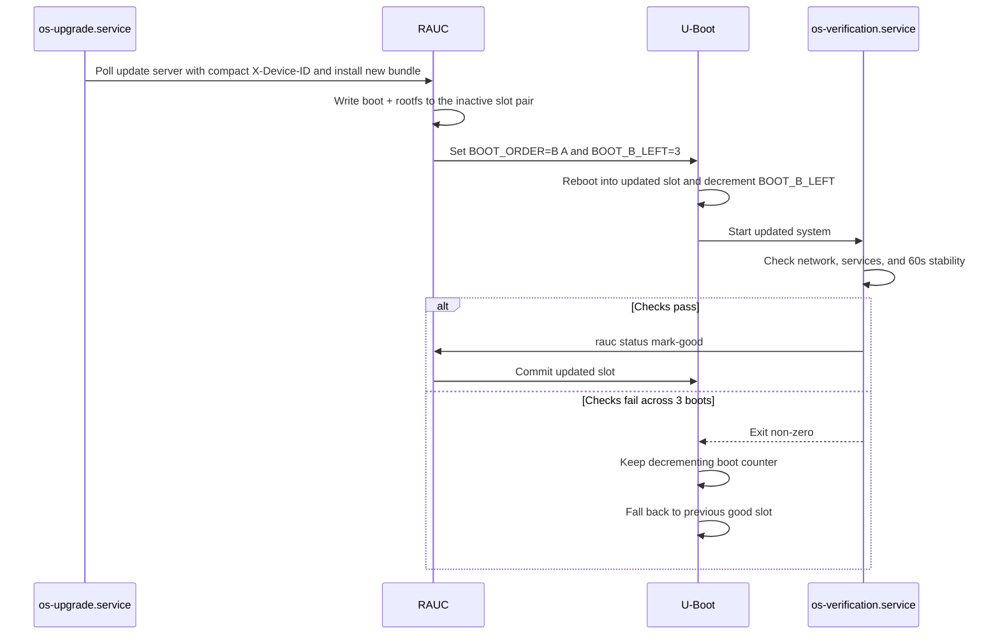

# Update & Rollback Flow

AtomixOS uses RAUC for A/B slot management combined with U-Boot boot-count logic and watchdog integration for automatic
recovery from failed updates.

## Normal Update Cycle

## Boot-Count Mechanism

U-Boot maintains three environment variables for slot selection:

| Variable      | Purpose                            | Example |
|---------------|------------------------------------|---------|
| `BOOT_ORDER`  | Slot priority (first = preferred)  | `"A B"` |
| `BOOT_A_LEFT` | Remaining boot attempts for slot A | `3`     |
| `BOOT_B_LEFT` | Remaining boot attempts for slot B | `3`     |

On each boot, U-Boot RAUC bootmeth selects the slot and decrements the boot attempt counter before loading
`boot.scr`. The script:

1. Reads the bootmeth-provided boot partition and root partition variables
2. Sets `rauc.slot` and `atomixos.lowerdev` for the selected slot
3. Loads kernel, initrd, and DTB from that slot's boot partition
4. Boots with `root=fstab` so initrd mounts the selected squashfs by lower device

If a slot's counter reaches 0, RAUC bootmeth skips it and tries the next slot in `BOOT_ORDER`. This ensures automatic
rollback after 3 consecutive boot failures.

## Health Check Details

The `os-verification.service` performs these checks before committing a slot:

1. **Service checks**: dnsmasq and chronyd must be active
2. **Network checks**: eth0 must have a WAN IP; eth1 must have the expected LAN gateway IP
3. **Sustained check**: all above conditions must hold for 60 seconds (checked every 5 seconds) to catch restart loops

Only after all checks pass does the service run `rauc status mark-good`, which resets the boot counter and commits the
slot.

## First Boot Exception

On initial device provisioning, `first-boot.service` writes the sentinel file
(`/data/.completed_first_boot`) after successful provisioning import/validation and marks the slot good only when RAUC
is enabled. After this, all subsequent boots use the full health-check path.

## Watchdog Integration (currently disabled on Rock64 during development)

The RK3328 hardware watchdog (`dw_wdt`) integration is implemented with these target settings:

- **Runtime watchdog**: 30 seconds -- if systemd hangs, the device reboots
- **Reboot watchdog**: 10 minutes -- if a reboot hangs, the watchdog forces a hard reset

These target settings are not enabled in the current release. When enabled later, both scenarios feed into the boot-count
rollback path: repeated unsuccessful boots decrement the selected slot counter until U-Boot returns to the previous slot.

## Update Polling

The `os-upgrade.service` runs on a systemd timer:

- First check: 5 minutes after boot
- Subsequent checks: every 1 hour (configurable)
- Random delay: up to 10 minutes (prevents thundering herd across fleet)

The service queries the update server with the compact lowercase 12-hex eth0 MAC as `X-Device-ID` and the current
version. If a newer bundle is available, it downloads to `/data`, installs via `rauc install`, and reboots. The hawkBit
path is reserved for future implementation and is not an operational update mode in the current image.
