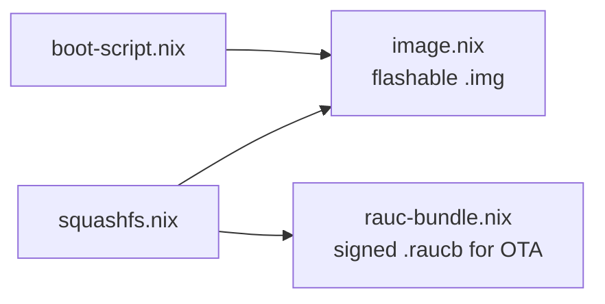

# Nix Derivations

The `nix/` directory contains four derivations that produce the build artifacts. Each is called from `flake.nix` via
`pkgs.callPackage`.

## Build Pipeline



---

## squashfs.nix

**Purpose**: Builds a read-only squashfs image from the full NixOS system closure.

**Function signature:**

```nix
{ stdenv, squashfsTools, closureInfo, nixosConfig, maxSquashfsSize }:
```

| Parameter         | Source                | Description                   |
|-------------------|-----------------------|-------------------------------|
| `nixosConfig`     | `rock64System.config` | Evaluated NixOS configuration |
| `maxSquashfsSize` | `flake.nix` (1 GB)    | Maximum allowed image size    |

**Delegates to:** `scripts/build-squashfs.sh`

**Build steps:**

1. Compute all Nix store paths from `closureInfo` of `system.build.toplevel`
2. Copy all store paths into a pseudo-root directory
3. Create `/init` and `/sbin/init` symlinks to the NixOS init
4. Create empty mount-point directories (`/proc`, `/sys`, `/dev`, `/run`, `/etc`, `/var`, `/tmp`, etc.)
5. Run `mksquashfs` with zstd compression (level 19), 1 MB block size
6. Fail if the image exceeds `maxSquashfsSize`

**Output:** `$out/rootfs.squashfs`

**Compression options:**

- Algorithm: zstd (level 19)
- Block size: 1 MiB (1048576)
- No xattrs
- All files owned by root

---

## rauc-bundle.nix

**Purpose**: Builds a signed RAUC bundle containing boot (kernel + initrd + DTB + boot.scr) and rootfs (squashfs) images.

**Function signature:**

```nix
{ stdenv, rauc, dosfstools, mtools, squashfsTools,
  nixosConfig, squashfsImage, bootScript, signingCert, signingKeyPath, caCert }:
```

| Parameter        | Source                         | Description                      |
|------------------|--------------------------------|----------------------------------|
| `nixosConfig`    | `rock64System.config`          | Provides kernel/initrd/DTB paths |
| `squashfsImage`  | `packages.squashfs`            | The squashfs derivation output   |
| `bootScript`     | `packages.boot-script`         | Compiled `boot.scr`              |
| `signingCert`    | `./certs/dev.signing.cert.pem` | RAUC signing certificate         |
| `signingKeyPath` | `./certs/dev.signing.key.pem`  | RAUC signing private key         |
| `caCert`         | `./certs/dev.ca.cert.pem`      | CA certificate for verification  |

**Delegates to:** `scripts/build-rauc-bundle.sh`

**Build steps:**

1. Create a 128 MB vfat image (`boot.vfat`)
2. Copy kernel `Image`, `initrd`, DTB, and `boot.scr` into it using mtools
3. Copy `rootfs.squashfs` into the bundle directory
4. Generate `manifest.raucm` with `compatible=rock64` and image definitions
5. Sign and package with `rauc bundle`

**Output:** `$out/rock64.raucb`

**Manifest structure:**

```ini
[update]
compatible=rock64
version=<nixosConfig.system.nixos.version>

[image.boot]
filename=boot.vfat
type=raw

[image.rootfs]
filename=rootfs.squashfs
type=raw
```

---

## boot-script.nix

**Purpose**: Compiles the U-Boot boot script from source (`boot.cmd` -> `boot.scr`).

**Function signature:**

```nix
{ stdenv, ubootTools, buildId }:
```

| Parameter | Source      | Description                                |
|-----------|-------------|--------------------------------------------|
| `buildId` | `flake.nix` | Build identifier echoed during U-Boot boot |

**Build step:**

```sh
mkimage -C none -A arm64 -T script -d boot.cmd boot.scr
```

**Output:** `$out/boot.scr` (compiled) and `$out/boot.cmd` (source copy)

---

## image.nix

**Purpose**: Assembles the complete flashable disk image for eMMC provisioning.

**Function signature:**

```nix
{ stdenv, dosfstools, mtools, util-linux,
  ubootRock64, nixosConfig, squashfsImage, bootScript }:
```

| Parameter       | Source                 | Description                  |
|-----------------|------------------------|------------------------------|
| `ubootRock64`   | nixpkgs                | U-Boot package for Rock64    |
| `nixosConfig`   | `rock64System.config`  | Provides kernel, initrd, DTB |
| `squashfsImage` | `packages.squashfs`    | Squashfs derivation          |
| `bootScript`    | `packages.boot-script` | Compiled boot.scr            |

**Delegates to:** `scripts/build-image.sh`

**Image layout (total ~1170 MiB sparse):**

| Offset  | Size      | Content     | Filesystem |
|---------|-----------|-------------|------------|
| 0       | 16 MB     | U-Boot raw  | --         |
| 16 MB   | 128 MB    | boot-a      | vfat       |
| 144 MB  | 1024 MB   | rootfs-a    | squashfs   |
| 1168 MB | remaining | unallocated | --         |

**Output:** `$out/atomixos-<series>.img`

The image name is derived from the pinned NixOS release series (e.g., `atomixos-25.11.img`). The image leaves the
remaining eMMC space unallocated so initrd `systemd-repart` can create `boot-b`, `rootfs-b`, and `/data` on first
boot.

**GPT partition types:** Boot partitions use the xbootldr GUID (`BC13C2FF-...`). Rootfs partitions use the Linux root
aarch64 GUID (`B921B045-...`), which is the architecturally correct type for aarch64 root filesystems.

**U-Boot raw writes:**

- `idbloader.img` at sector 64 (32 KB)
- `u-boot.itb` at sector 16384 (8 MB)

**boot-a contents:** kernel `Image`, `initrd`, DTB (`rockchip/rk3328-rock64.dtb`), `boot.scr`
