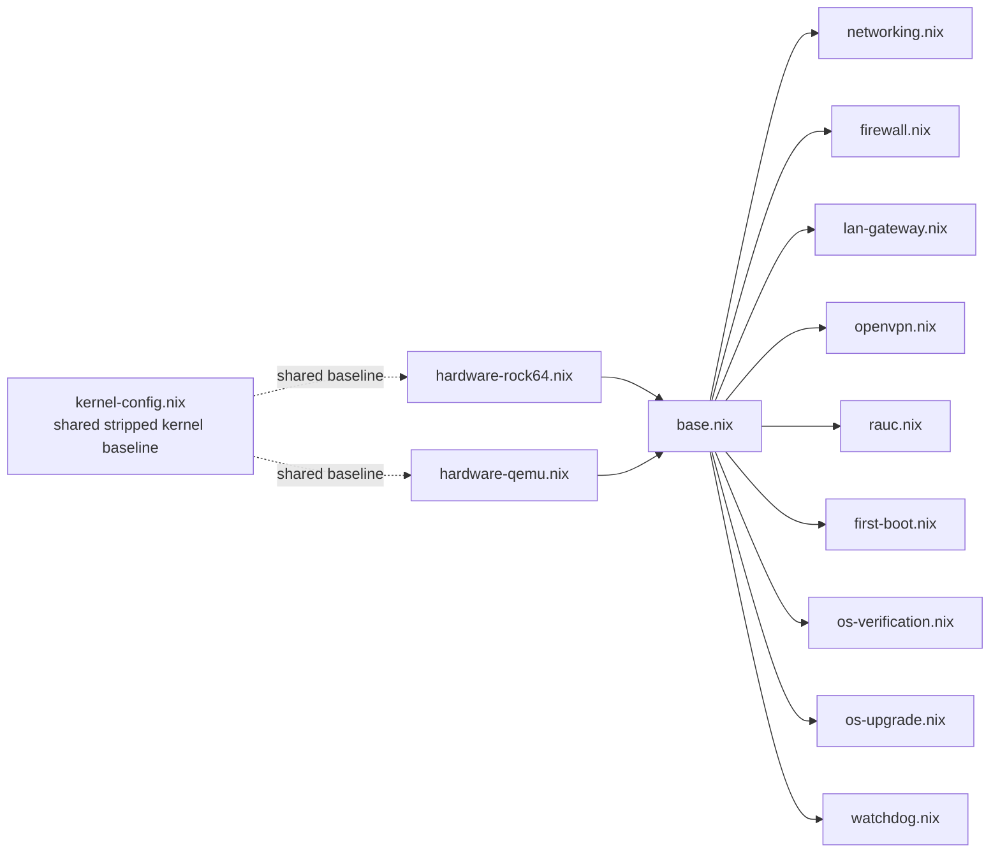

# NixOS Modules

All NixOS modules live in the `modules/` directory. `base.nix` imports all service modules and is itself imported by the
hardware-specific modules (`hardware-rock64.nix`, `hardware-qemu.nix`).

## Module Dependency Graph



---

## base.nix

**Purpose**: Shared NixOS configuration for both hardware and QEMU targets. Defines the core system layout, filesystem
mounts, user accounts, and system packages.

**Key configuration:**

| Setting                | Value       | Notes                             |
|------------------------|-------------|-----------------------------------|
| `system.stateVersion`  | `"25.11"`   | NixOS release                     |
| `networking.hostName`  | `"gateway"` |                                   |
| `nix.enable`           | `false`     | No Nix daemon on read-only rootfs |
| `documentation.enable` | `false`     | Saves closure space               |
| `security.sudo.enable` | `false`     | Uses `run0` instead               |

**Filesystem layout (OverlayFS root):**

The root filesystem uses a single OverlayFS assembled in the initrd from the selected squashfs slot and tmpfs-backed
upper/work directories:

| Layer              | Mount                 | Filesystem | Size    | Description                                               |
|--------------------|-----------------------|------------|---------|-----------------------------------------------------------|
| overlay (combined) | `/`                   | overlay    | --      | Unified writable root presented to userspace              |
| lower (read-only)  | `/run/rootfs-base`    | squashfs   | --      | Immutable NixOS system from the selected RAUC rootfs slot |
| upper (writable)   | `/run/overlay-root/*` | tmpfs      | runtime | Ephemeral writes, lost on reboot                          |
| persistent state   | `/data`               | f2fs       | dynamic | Created on first boot (`PARTLABEL=data`, nofail)          |

The overlay is assembled in the initrd before `switch_root`:

1. `boot.scr` passes `root=fstab` and `atomixos.lowerdev=/dev/...` for the selected squashfs slot
2. `initrd-prepare-overlay-lower.service` mounts that slot read-only at `/run/rootfs-base`
3. `sysroot.mount` mounts `/` as overlay with `lowerdir=/run/rootfs-base`, `upperdir=/run/overlay-root/upper`, and `workdir=/run/overlay-root/work`
4. `sysroot-run.mount` bind-mounts `/run` into the switched root

This approach replaces the older `/sysroot` mutation logic and keeps the root mount fstab-driven, which fits systemd's
initrd model more cleanly.

The lower squashfs is selected by U-Boot/RAUC, while `/data` remains outside the A/B slots and survives updates.

**Sandboxing note:** `nsncd` (the NSS lookup daemon) runs as root due to permission issues on the overlay filesystem.

**Network wait:** `systemd-networkd-wait-online` is configured with a 30s timeout and `anyInterface=true`.

**Build ID:** The NixOS login banner (`/etc/issue`) displays the build ID for easy identification.

**Data partition:** Not included in the flashable image. Initrd `systemd-repart` creates it from the remaining eMMC space
on first boot.

**tmpfiles.d rules** (created on boot):

```text
/var/empty, /var/lib, /var/lib/systemd/network, /var/lib/private,
/var/lib/private/systemd/resolve, /var/lib/chrony, /var/lib/dnsmasq,
/var/cache, /var/cache/nscd, /var/log, /var/log/journal, /var/db, /var/run
```

**User accounts:**

| User    | Groups  | Authentication                                                                                          |
|---------|---------|---------------------------------------------------------------------------------------------------------|
| `root`  | --      | Empty password (development)                                                                            |
| `admin` | `wheel` | Password from `/data/config/admin-password-hash`; SSH key from `/data/config/ssh-authorized-keys/admin` |

**System packages:** `nano`, `htop`, `curl`, `jq`, `f2fs-tools`, `kmod`

---

## hardware-rock64.nix

**Purpose**: Rock64 (RK3328) hardware-specific kernel, device tree, and RAUC slot mapping.

**Kernel configuration:**

| Category    | Drivers                                                          | Build           |
|-------------|------------------------------------------------------------------|-----------------|
| eMMC        | `MMC_DW`, `MMC_DW_ROCKCHIP`                                      | built-in (`=y`) |
| Ethernet    | `STMMAC_ETH`, `DWMAC_ROCKCHIP`                                   | built-in        |
| USB         | `DWC2`, `USB_XHCI_HCD`, `USB_EHCI_HCD`, `USB_OHCI_HCD`           | built-in        |
| Watchdog    | `DW_WATCHDOG`                                                    | built-in        |
| Filesystems | `SQUASHFS`, `SQUASHFS_ZSTD`, `F2FS_FS`, `OVERLAY_FS`             | built-in        |
| WiFi        | `RTL8XXXU`, `ATH9K_HTC`, `MT76_USB`, `MT7601U`, `RTW88`, `RTW89` | module (`=m`)   |
| Bluetooth   | `BT`, `BT_HCIBTUSB`                                              | module          |
| USB Serial  | `FTDI_SIO`, `CP210X`                                             | module          |

**RAUC slot mapping:**

```nix
atomixos.rauc.slots = {
  boot0 = "/dev/mmcblk1p1";     # boot-a
  boot1 = "/dev/mmcblk1p3";     # boot-b
  rootfs0 = "/dev/mmcblk1p2";   # rootfs-a
  rootfs1 = "/dev/mmcblk1p4";   # rootfs-b
};
```

**Serial console:** `ttyS2` at 1.5 Mbaud (Rock64 UART2), enabled via `serial-getty@ttyS2.service`.

---

## kernel-config.nix

**Purpose**: Shared stripped kernel baseline used by both Rock64 and QEMU so the VM target stays close to the real
device kernel.

**Contents:**

- `baseKernelConfig`: the common stripped ARM64 gateway kernel baseline
- `optionalKernelConfig`: isolated optional USB serial support

`hardware-qemu.nix` imports this file and layers only the minimal `aarch64-virt`, virtio, and test-harness-specific
requirements on top.

---

## hardware-qemu.nix

**Purpose**: QEMU aarch64-virt configuration for development and testing.

**Differences from hardware-rock64.nix:**

| Setting        | Rock64            | QEMU                             |
|----------------|-------------------|----------------------------------|
| Boot method    | U-Boot `boot.scr` | extlinux                         |
| Block devices  | `/dev/mmcblk1pN`  | `/dev/vdN` (virtio)              |
| RAUC backend   | `uboot`           | `custom` (file-based)            |
| Kernel modules | Hardware-specific | `virtio_pci`, `virtio_blk`, etc. |

The QEMU RAUC tests share their slot mapping through `nix/tests/rauc-qemu-config.nix`:

```nix
atomixos.rauc = {
  slots = {
    boot0 = "/dev/vdb";
    boot1 = "/dev/vdc";
    rootfs0 = "/dev/vdd";
    rootfs1 = "/dev/vde";
  };
  bootloader = "custom";
};
```

---

## networking.nix

**Purpose**: Deterministic NIC naming and systemd-networkd configuration.

**Link files:**

| Priority         | Match                                        | Result                                     |
|------------------|----------------------------------------------|--------------------------------------------|
| `10-onboard-eth` | Platform `platform-ff540000.ethernet`        | Name = `eth0`                              |
| `20-usb-eth`     | Drivers `r8152`, `ax88179_178a`, `cdc_ether` | Enabled as modules in Rock64 kernel config |
| `30-wifi`        | WiFi drivers                                 | Kernel default                             |

**Network files:**

| Priority | Interface | Configuration                            |
|----------|-----------|------------------------------------------|
| `10-wan` | `eth0`    | DHCP v4, uses DHCP DNS, no NTP from DHCP |
| `20-lan` | `eth1`    | Static `172.20.30.1/24`, no DHCP         |

**Sysctl:** `net.ipv4.ip_forward = 0`, `net.ipv6.conf.all.forwarding = 0`

---

## firewall.nix

**Purpose**: nftables firewall with per-interface rules and dynamic SSH-on-WAN toggle.

**nftables rules (inet filter):**

| Chain     | Policy | Rules                                                                                                    |
|-----------|--------|----------------------------------------------------------------------------------------------------------|
| `input`   | drop   | lo: accept; established: accept; eth0: TCP 443, UDP 1194; eth1: UDP 67-68, UDP 123, TCP 22; tun0: TCP 22 |
| `forward` | drop   | (no exceptions)                                                                                          |
| `output`  | accept |                                                                                                          |

**Dynamic SSH toggle services:**

| Service          | When                  | What                                          |
|------------------|-----------------------|-----------------------------------------------|
| `ssh-wan-toggle` | Boot (after nftables) | Reads flag file, adds SSH rule if present     |
| `ssh-wan-reload` | On demand             | Removes old rule, re-adds if flag file exists |

Flag file: `/data/config/ssh-wan-enabled`

---

## lan-gateway.nix

**Purpose**: DHCP and NTP server for isolated LAN devices.

**dnsmasq configuration:**

| Setting        | Value                                        |
|----------------|----------------------------------------------|
| Interface      | `eth1` (bind-interfaces)                     |
| DHCP range     | `172.20.30.10` -- `172.20.30.254`, 24h lease |
| Gateway option | `172.20.30.1`                                |
| DNS option     | (empty -- no DNS forwarding)                 |
| NTP option     | `172.20.30.1`                                |
| DNS port       | `0` (disabled)                               |

**chrony configuration:**

| Setting  | Value                      |
|----------|----------------------------|
| Upstream | `pool pool.ntp.org iburst` |
| Serve to | `172.20.30.0/24` only      |
| Fallback | `local stratum 10`         |

---

## rauc.nix

**Purpose**: RAUC A/B update system configuration. Defines project options (`atomixos.rauc.*`) and maps them onto the
upstream NixOS `services.rauc` module.

**Custom NixOS options (`atomixos.rauc.*`):**

| Option          | Type            | Default                   | Description                       |
|-----------------|-----------------|---------------------------|-----------------------------------|
| `compatible`    | string          | `"rock64"`                | RAUC compatible string            |
| `bootloader`    | enum            | `"uboot"`                 | Backend (`uboot`, `custom`, etc.) |
| `statusFile`    | string          | `/data/rauc/status.raucs` | RAUC status file                  |
| `bundleFormats` | list of strings | `[-plain, +verity]`       | Allowed bundle formats            |
| `slots.boot0`   | string          | (required)                | Boot slot A device path           |
| `slots.boot1`   | string          | (required)                | Boot slot B device path           |
| `slots.rootfs0` | string          | (required)                | Rootfs slot A device path         |
| `slots.rootfs1` | string          | (required)                | Rootfs slot B device path         |

When `bootloader = "custom"`, a file-based shell script is generated that simulates U-Boot environment management using
files in `/var/lib/rauc/`.

---

## watchdog.nix

**Purpose**: systemd hardware watchdog configuration (currently disabled on Rock64 during development).

```nix
systemd.settings.Manager = {
  # RuntimeWatchdogSec = "30s";
  # RebootWatchdogSec = "10min";
};
```

---

## os-verification.nix

**Purpose**: Post-update health-check service.

| Setting   | Value                                             |
|-----------|---------------------------------------------------|
| Type      | oneshot                                           |
| Condition | `ConditionPathExists=/data/.completed_first_boot` |
| Timeout   | 180s                                              |
| Script    | `scripts/os-verification.sh`                      |
| PATH      | `rauc`, `jq`, `systemd`, `iproute2`               |

---

## os-upgrade.nix

**Purpose**: OTA update polling service.

**Custom NixOS options (`os-upgrade.*`):**

| Option            | Type   | Default                      | Description                    |
|-------------------|--------|------------------------------|--------------------------------|
| `useHawkbit`      | bool   | `false`                      | Switch to rauc-hawkbit-updater |
| `pollingInterval` | string | `"1h"`                       | Timer interval                 |
| `serverUrl`       | string | `"http://localhost/updates"` | Update server URL              |

**Timer:** `OnBootSec=5min`, `OnUnitActiveSec=<pollingInterval>`, `RandomizedDelaySec=10min`

---

## first-boot.nix

**Purpose**: One-time first-boot slot confirmation.

| Setting   | Value                                              |
|-----------|----------------------------------------------------|
| Type      | oneshot                                            |
| Condition | `ConditionPathExists=!/data/.completed_first_boot` |
| Script    | `scripts/first-boot.sh`                            |
| Effect    | `rauc status mark-good` + write sentinel           |

Mutually exclusive with `os-verification.service` via the sentinel file.

---

## openvpn.nix

**Purpose**: OpenVPN recovery tunnel.

| Setting     | Value                                                  |
|-------------|--------------------------------------------------------|
| Config path | `/data/config/openvpn/client.conf`                     |
| Auto-start  | `false`                                                |
| Condition   | `ConditionPathExists=/data/config/openvpn/client.conf` |
