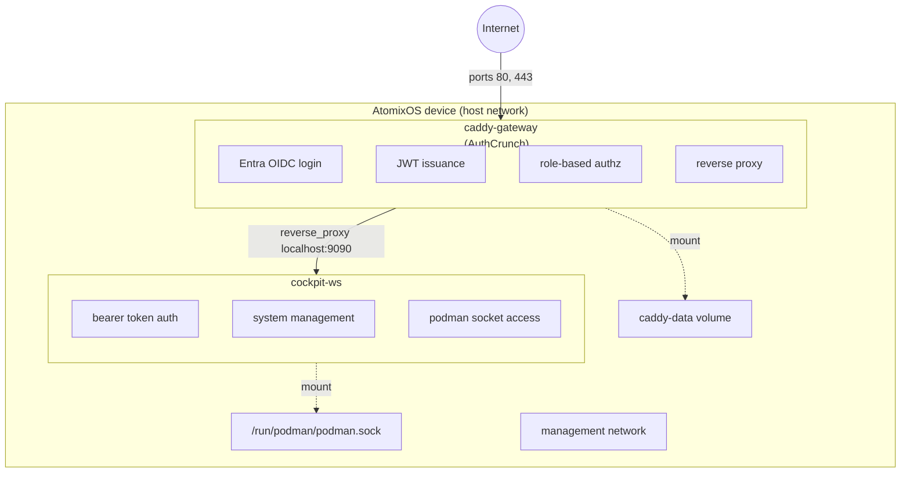

# Design: caddy-authcrunch-cockpit-tutorial

## Summary

A documentation-only tutorial that provides a fully working `config.toml` bundle
demonstrating Caddy with the AuthCrunch plugin for Microsoft Entra OIDC authentication,
JWT-based group-to-role mapping, and Cockpit-ws for device management -- all provisioned
through AtomixOS's existing config.toml system.

## Goal

An operator can copy the tutorial config, substitute their Azure and domain values, build
a config bundle, and provision an AtomixOS device with a working OIDC-authenticated
management stack. The tutorial exercises every major config.toml feature: containers,
networks, volumes, builds, bundle files, and token substitution.

## Architecture

### Container Topology



### Authentication Flow

1. User navigates to `https://gateway.example.com/cockpit/`
2. Caddy's authorization policy checks for a valid JWT cookie
3. If no cookie: redirect to `/auth/` which initiates Entra OIDC login
4. AuthCrunch receives the OIDC ID token, maps Entra groups to local roles:
   - Entra group `AtomixOS-Admins` -> `authp/admin`
   - Entra group `AtomixOS-Users` -> `authp/user`
5. AuthCrunch issues a local JWT cookie with the mapped roles
6. Caddy's authorization policy validates the JWT and allows the request
7. Caddy reverse-proxies to cockpit-ws at `localhost:9090`
8. Cockpit-ws receives the request with the `Authorization: Bearer <token>` header
9. Cockpit's `[bearer]` auth section invokes a token verification command
10. The verification command validates the JWT signature, extracts the user identity,
    and starts a cockpit-bridge session as the mapped local user

### Bearer Token Bridge

Cockpit supports pluggable authentication via `cockpit.conf` sections. The `[bearer]`
section specifies a command that:

1. Receives the bearer token via the cockpit authorize protocol (`*` challenge)
2. Validates the JWT signature against the shared signing key
3. Extracts the user identity and roles from the JWT claims
4. Maps `authp/admin` to the `admin` system user (sudoless admin)
5. Maps `authp/user` to a restricted `viewer` user
6. Launches `cockpit-bridge` as the mapped user

This eliminates double authentication: the user logs in once via Entra OIDC, and
Cockpit trusts the AuthCrunch JWT.

Source: [Cockpit authentication docs](https://github.com/cockpit-project/cockpit/blob/main/doc/authentication.md)

### Cockpit-Podman Integration

The `cockpit-podman` package communicates with Podman via its REST API through
cockpit-bridge running on the host. For this to work:

1. The cockpit-ws container connects to the host's SSH or uses `--local-ssh` mode
2. cockpit-bridge runs on the host and has access to the Podman socket
3. cockpit-podman must be installed on the host (in the NixOS closure)

On AtomixOS, the rootfs is read-only squashfs. Adding `cockpit-podman` to the NixOS
closure is a base image change. The tutorial documents this requirement and provides a
NixOS module sketch that operators would add to their device build.

Alternative: mount the Podman socket (`/run/podman/podman.sock`) into the cockpit-ws
container directly. Cockpit-ws in `--local-ssh` mode connects to `127.0.0.1:22` on the
host, where cockpit-bridge can access the Podman socket natively. The `appsvc` user is in
the `podman` group, giving it socket access.

## Bundle Structure

```text
config.example.toml
files/
  caddy/
    Caddyfile
  cockpit/
    Containerfile             # Custom cockpit-ws image (adds Python 3)
    cockpit.conf
    cockpit-bearer-auth       # JWT verification script
```

## config.toml Design

### Containers

| Container     | Image                                         | Privileged | Network       | Purpose                  |
|---------------|-----------------------------------------------|------------|---------------|--------------------------|
| caddy-gateway | `ghcr.io/authcrunch/authcrunch:latest`        | true       | host (forced) | OIDC auth, reverse proxy |
| cockpit-ws    | custom build from `quay.io/cockpit/ws:latest` | true       | host (forced) | Device management UI     |

The cockpit-ws container uses a custom Containerfile that adds Python 3 to the base
`quay.io/cockpit/ws` image. The upstream image is Fedora minimal and does not include
Python, which the bearer auth script requires. The custom image is built via Quadlet
`.build` support.

Both containers are rootful: Caddy binds privileged ports 80/443, and Cockpit-ws
needs host-level access for system management (SSH sessions, D-Bus).

### Builds

| Build      | Base Image                  | Additions | Purpose                    |
|------------|-----------------------------|-----------|----------------------------|
| cockpit-ws | `quay.io/cockpit/ws:latest` | `python3` | Bearer auth script runtime |

The `cockpit-ws.build` Quadlet unit builds the custom cockpit-ws image from a
Containerfile in the bundle. This exercises the new `.build` config.toml feature.

### Networks

| Network    | Purpose                                                                       |
|------------|-------------------------------------------------------------------------------|
| management | Future use: inter-container communication if containers move off host network |

The management network demonstrates the `[network.*]` config.toml feature. In the initial
tutorial both containers use host networking, so the network is defined but not actively
used by the containers. This is intentional: it shows operators how to define networks and
provides a foundation for moving to bridge networking later.

### Volumes

| Volume     | Purpose                                     |
|------------|---------------------------------------------|
| caddy-data | Persistent Caddy state (certificates, ACME) |

### Bundle Files

| File                                | Mount Target                         | Purpose                            |
|-------------------------------------|--------------------------------------|------------------------------------|
| `files/caddy/Caddyfile`             | `/etc/caddy/Caddyfile`               | AuthCrunch + OIDC configuration    |
| `files/cockpit/Containerfile`       | build context                        | Custom cockpit-ws image definition |
| `files/cockpit/cockpit.conf`        | `/etc/cockpit/cockpit.conf`          | Cockpit WebService configuration   |
| `files/cockpit/cockpit-bearer-auth` | `/usr/local/bin/cockpit-bearer-auth` | JWT verification script            |

### Environment Variables (via Quadlet `Environment`)

| Variable              | Container                 | Purpose                              |
|-----------------------|---------------------------|--------------------------------------|
| `AZURE_TENANT_ID`     | caddy-gateway             | Entra directory/tenant ID            |
| `AZURE_CLIENT_ID`     | caddy-gateway             | Entra app registration client ID     |
| `AZURE_CLIENT_SECRET` | caddy-gateway             | Entra app registration client secret |
| `JWT_SHARED_KEY`      | caddy-gateway, cockpit-ws | Shared secret for JWT sign/verify    |

## Caddyfile Design

```caddyfile
{
    http_port 80
    https_port 443
    admin off

    order authenticate before respond
    order authorize before basicauth

    security {
        oauth identity provider azure {
            realm azure
            driver azure
            tenant_id {env.AZURE_TENANT_ID}
            client_id {env.AZURE_CLIENT_ID}
            client_secret {env.AZURE_CLIENT_SECRET}
            scopes openid email profile
        }

        authentication portal myportal {
            crypto default token lifetime 3600
            crypto key sign-verify {env.JWT_SHARED_KEY}
            enable identity provider azure

            transform user {
                match realm azure
                action add role authp/user
            }

            transform user {
                match realm azure
                match roles <ENTRA_ADMIN_GROUP_NAME>
                action add role authp/admin
            }
        }

        authorization policy mgmt-policy {
            set auth url /auth/
            crypto key verify {env.JWT_SHARED_KEY}
            allow roles authp/admin authp/user
            validate bearer header
            inject headers with claims
        }
    }
}

<GATEWAY_DOMAIN> {
    route /auth* {
        authenticate with myportal
    }

    route /cockpit/* {
        authorize with mgmt-policy
        reverse_proxy localhost:9090
    }
}
```

## cockpit.conf Design

```ini
[WebService]
AllowUnencrypted = true
LoginTo = false
ProtocolHeader = X-Forwarded-Proto
Origins = https://<GATEWAY_DOMAIN>
UrlRoot = /cockpit/

[bearer]
command = /usr/local/bin/cockpit-bearer-auth
timeout = 300

[Session]
IdleTimeout = 30
```

## Bearer Auth Script Design

A small Python script (`cockpit-bearer-auth`) that:

1. Reads the cockpit protocol on stdin
2. Sends an authorize command with `*` challenge
3. Receives the bearer token from the response
4. Validates the JWT using the `JWT_SHARED_KEY` environment variable
5. Extracts user email and roles from JWT claims
6. Maps roles to local users:
   - `authp/admin` -> exec cockpit-bridge as `admin`
   - `authp/user` -> exec cockpit-bridge as `viewer` (or `admin` read-only)
7. Execs `cockpit-bridge` with appropriate user context

The script uses only Python stdlib (`json`, `hmac`, `hashlib`, `base64`) for JWT
validation (HS256), avoiding any pip dependencies.

## Azure App Registration Prerequisites

The tutorial must document these Azure portal steps:

1. Register a new App Registration in Microsoft Entra ID
2. Set redirect URI: `https://<gateway-domain>/auth/oauth2/azure/authorization-code-callback`
3. Create a client secret
4. Under "Token Configuration" -> "Add groups claim" -> Select "Security groups"
5. Note the Tenant ID, Client ID, and Client Secret
6. Create Entra security groups (e.g., `AtomixOS-Admins`, `AtomixOS-Users`)
7. Assign users to groups

## Constraints

- Must use only config.toml features that exist today or are added as part of this
  feature (`.build` Quadlet support is a new prerequisite)
- Both containers must be rootful (host network for port access)
- Tutorial values (tenant ID, client ID, domain) use obvious `<PLACEHOLDER>` markers
- Must not require changes to the AtomixOS base image schema beyond `.build` support
- Bearer auth script must use only Python stdlib (no pip)
- The tutorial config must pass `first-boot-provision validate`

## Non-Goals

- Production-hardening (certificate pinning, secret rotation, HA)
- Implementing cockpit-podman as a NixOS module (documented as future work)
- Custom PAM module for JWT validation (bearer auth command is sufficient)
- SAML or non-Entra OIDC providers (tutorial focuses on Entra)

## Success Criteria

1. Tutorial config passes `first-boot-provision validate`
2. NixOS VM test imports the tutorial bundle and verifies all rendered Quadlet files
3. Documentation clearly explains the authentication flow end-to-end
4. Role mapping is demonstrated with two Entra groups
5. Bearer token bridge eliminates double authentication
6. Cockpit-podman requirements and limitations are documented honestly

## Risks and Tradeoffs

| Risk                                         | Impact                                                               | Mitigation                                                           |
|----------------------------------------------|----------------------------------------------------------------------|----------------------------------------------------------------------|
| AuthCrunch Caddyfile syntax changes          | Tutorial breaks on version upgrade                                   | Pin image tag in tutorial; note version tested                       |
| Bearer auth script security                  | Shared HMAC key could be extracted from container env                | Document that production deployments should use asymmetric keys      |
| cockpit-podman requires NixOS closure change | Operators cannot manage containers via Cockpit without image rebuild | Document the gap; provide NixOS module sketch                        |
| Entra group claim configuration              | Groups may appear as GUIDs not names                                 | Document Azure portal Token Configuration steps                      |
| JWT_SHARED_KEY in container env              | Secret visible in Quadlet file on disk                               | Document that production should use secret files                     |
| cockpit/ws image lacks Python                | Bearer auth script cannot run without custom build                   | Custom Containerfile adds python3; `.build` Quadlet support required |

## Dependencies

Existing dependencies are satisfied. One new capability is required:

- Network and volume Quadlet support (completed: `85ec53c`)
- Bundle file support with `${FILES_DIR}` token substitution (completed)
- Container, network, volume rendering and sync (completed)
- **Quadlet `.build` support (new)**: schema, rendering, sync, and test updates needed
  to support `[build.*]` sections in config.toml that produce `.build` Quadlet units.
  This is implemented as a prerequisite task within this feature.

## Affected Documentation

- `docs/src/SUMMARY.md` -- add tutorial entry under new Tutorials section
- `docs/src/planned-features.md` -- update status to `in-progress`
- New: `docs/src/features/caddy-authcrunch-cockpit-tutorial/design.md` (this file)
- New: `docs/src/features/caddy-authcrunch-cockpit-tutorial/tasks.md`
- New: tutorial page under `docs/src/tutorials/`

## Open Design Questions

None. All questions from the project plan have been resolved:

- **Cockpit-ws auth**: Resolved via bearer token auth command (Cockpit's native
  pluggable auth, documented in cockpit's authentication.md)
- **Cockpit-podman**: Documented as requiring host-side installation; tutorial provides
  NixOS module sketch; Podman socket mount is the container integration path
