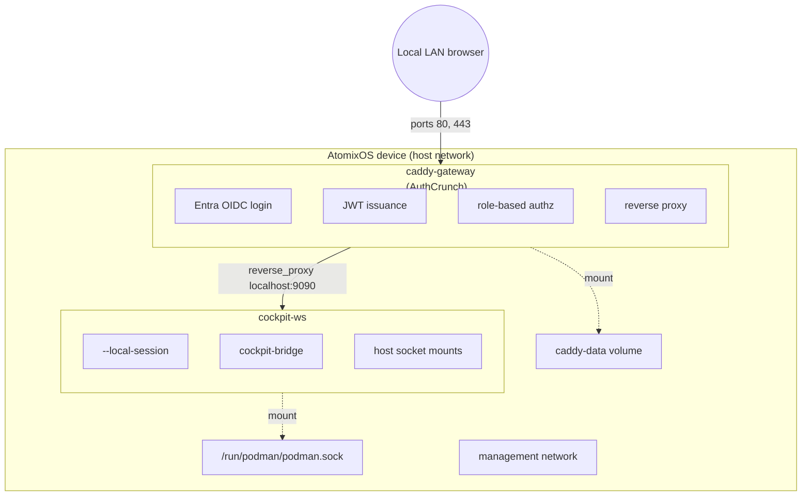

# Design: caddy-authcrunch-cockpit-tutorial

## Summary

A documentation-only tutorial that provides a fully working local-management
`config.toml` bundle demonstrating Caddy with the AuthCrunch plugin for
Microsoft Entra OIDC authentication, provider-swap guidance for Google and other
OIDC providers, JWT-based group-to-role mapping, and Cockpit-ws for device
management -- all provisioned through AtomixOS's existing config.toml system.

## Goal

An operator can copy the tutorial config, substitute their identity-provider and
local DNS values, build a config bundle, and provision an AtomixOS device with
a working OIDC-authenticated management stack that does not need public DNS,
public ACME validation, or inbound internet exposure. The tutorial exercises
every major config.toml feature: containers, networks, volumes, builds, bundle
files, and token substitution.

## Architecture

### Container Topology



### Authentication Flow

1. User navigates to `https://gateway.example.com/cockpit/`, where the gateway
   name resolves locally to the device's LAN address
2. Caddy's authorization policy checks for a valid JWT cookie
3. If no cookie: redirect to `/auth/` which initiates Entra OIDC login
4. AuthCrunch receives the OIDC ID token, maps Entra groups to local roles:
   - Entra group `AtomixOS-Admins` -> `authp/admin`
   - Entra group `AtomixOS-Users` -> `authp/user`
5. AuthCrunch issues a local JWT cookie with the mapped roles
6. Caddy's authorization policy validates the JWT and allows the request
7. Caddy reverse-proxies to cockpit-ws at `localhost:9090`
8. Cockpit-ws runs with `--local-session` and does not perform a second login
9. The local cockpit-bridge session uses mounted host sockets for system and
   Podman management

### Caddy-Gated Local Session

The tutorial uses Caddy + AuthCrunch as the authentication and authorization
boundary. Cockpit-ws runs behind Caddy with `--local-session`, so Cockpit starts
`cockpit-bridge` directly and trusts the reverse proxy boundary. The Cockpit
route is admin-only; user-facing applications can use a separate policy that
allows both `authp/admin` and `authp/user`.

### Cockpit-Podman Integration

The `cockpit-podman` package communicates with Podman via its REST API through
the Podman socket. This tutorial installs `cockpit-podman` into the custom
Cockpit container and mounts `/run/podman/podman.sock`, so administrators can
manage host containers after Caddy authorizes access to `/cockpit/*`.

## Bundle Structure

```text
example/caddy-oidc/
config.toml
files/
  caddy/
    Caddyfile
  cockpit/
    Containerfile             # Custom cockpit-ws image (adds management modules)
```

## config.toml Design

### Containers

| Container     | Image                                            | Privileged | Network       | Purpose                  |
|---------------|--------------------------------------------------|------------|---------------|--------------------------|
| caddy-gateway | `ghcr.io/authcrunch/authcrunch:latest`           | true       | host (forced) | OIDC auth, reverse proxy |
| cockpit-ws    | custom build from `quay.io/fedora/fedora:latest` | true       | host (forced) | Device management UI     |

The cockpit-ws container uses a custom Containerfile based on Fedora that installs
`cockpit-ws`, Cockpit bridge, and management modules. The custom image is built
via Quadlet `.build` support.

Caddy is rootful because it binds privileged ports 80/443. Cockpit-ws is
rootful because the example intentionally exposes a local admin session with
host D-Bus, systemd, journal, and Podman sockets mounted into the container.

### Builds

| Build      | Base Image                     | Additions                  | Purpose               |
|------------|--------------------------------|----------------------------|-----------------------|
| cockpit-ws | `quay.io/fedora/fedora:latest` | Cockpit management modules | Admin console runtime |

The `cockpit-ws.build` Quadlet unit builds the custom cockpit-ws image from a
Containerfile in the bundle. This exercises the new `.build` config.toml feature.
The build uses `Network = "host"` so package installation does not depend on
Podman's build-time netavark/nftables network setup.

The `cockpit-ws.container` unit requires and starts after
`cockpit-ws-build.service`, and sets `Pull = "never"` so Podman uses the local
build output instead of trying to resolve `localhost/cockpit-ws:latest` as a
registry image.

### Networks

| Network    | Purpose                                                                       |
|------------|-------------------------------------------------------------------------------|
| management | Future use: inter-container communication if containers move off host network |

The management network demonstrates the `[network.*]` config.toml feature. In the initial
tutorial both containers use host networking, so the network is defined but not actively
used by the containers. This is intentional: it shows operators how to define networks and
provides a foundation for moving to bridge networking later.

### Volumes

| Volume     | Purpose                                     |
|------------|---------------------------------------------|
| caddy-data | Persistent Caddy state (certificates, ACME) |

### Bundle Files

| File                          | Mount Target           | Purpose                            |
|-------------------------------|------------------------|------------------------------------|
| `files/caddy/Caddyfile`       | `/etc/caddy/Caddyfile` | AuthCrunch + OIDC configuration    |
| `files/cockpit/Containerfile` | build context          | Custom cockpit-ws image definition |

### Environment Variables (via Quadlet `Environment`)

| Variable                 | Container                 | Purpose                               |
|--------------------------|---------------------------|---------------------------------------|
| `AZURE_TENANT_ID`        | caddy-gateway             | Entra directory/tenant ID             |
| `AZURE_CLIENT_ID`        | caddy-gateway             | Entra app registration client ID      |
| `AZURE_CLIENT_SECRET`    | caddy-gateway             | Entra app registration client secret  |
| `ENTRA_ADMIN_GROUP_NAME` | caddy-gateway             | Entra group promoted to `authp/admin` |
| `GATEWAY_DOMAIN`         | caddy-gateway, cockpit-ws | Local device DNS name                 |
| `JWT_SHARED_KEY`         | caddy-gateway             | Shared secret for JWT sign/verify     |

## Caddyfile Design

```caddyfile
{
    http_port 80
    https_port 443
    admin off

    order authenticate before respond
    order authorize before basicauth

    security {
        oauth identity provider azure {
            realm azure
            driver azure
            tenant_id {env.AZURE_TENANT_ID}
            client_id {env.AZURE_CLIENT_ID}
            client_secret {env.AZURE_CLIENT_SECRET}
            scopes openid email profile
        }

        authentication portal myportal {
            crypto default token lifetime 3600
            crypto key sign-verify {env.JWT_SHARED_KEY}
            enable identity provider azure

            ui {
                links {
                    "Cockpit" /cockpit/ icon "las la-server"
                }
            }

            transform user {
                match realm azure
                action add role authp/user
            }

            transform user {
                match realm azure
                match roles {$ENTRA_ADMIN_GROUP_NAME}
                action add role authp/admin
            }
        }

        authorization policy user-policy {
            set auth url /auth/
            crypto key verify {env.JWT_SHARED_KEY}
            allow roles authp/admin authp/user
            validate bearer header
            inject headers with claims
        }

        authorization policy admin-policy {
            set auth url /auth/
            crypto key verify {env.JWT_SHARED_KEY}
            allow roles authp/admin
            validate bearer header
            inject headers with claims
        }
    }
}

{$GATEWAY_DOMAIN} {
    tls internal

    redir / /cockpit/ 302
    redir /cockpit /cockpit/ 302

    route /auth* {
        authenticate with myportal
    }

    route /cockpit/* {
        authorize with admin-policy
        reverse_proxy localhost:9090
    }

    # Add user-facing applications here. They can use user-policy to allow
    # both admin and user roles.
    # route /app/* {
    #     authorize with user-policy
    #     reverse_proxy localhost:8080
    # }
}
```

## Local TLS Design

The tutorial is meant to work locally, not as an internet-facing deployment.
Caddy uses `tls internal` so certificate issuance is handled by Caddy's local CA
instead of Let's Encrypt. Operators must ensure their management workstation
resolves `GATEWAY_DOMAIN` to the device's LAN address and either trusts the
Caddy local root CA or accepts the browser warning during testing.

This intentionally avoids the failure mode where a local gateway name resolves
to a public IP, causing ACME HTTP-01/TLS-ALPN-01 validation to time out against a
host that is not the AtomixOS device.

## Cockpit Local Session Design

The custom Cockpit image runs:

```text
cockpit-ws --no-tls --local-session /usr/bin/cockpit-bridge
```

This deliberately disables Cockpit's own login flow. Caddy is the only public
entry point and must authorize `/cockpit/*` with `admin-policy` before traffic
reaches cockpit-ws.

The custom image writes `/etc/cockpit/cockpit.conf` at startup using
`GATEWAY_DOMAIN` from `config.toml`, keeping all operator-editable placeholders
in one file.

## Azure App Registration Prerequisites

The tutorial must document these Azure portal steps:

1. Register a new App Registration in Microsoft Entra ID
2. Set redirect URI: `https://<gateway-domain>/auth/oauth2/azure/authorization-code-callback`
3. Create a client secret
4. Under "Token Configuration" -> "Add groups claim" -> Select "Security groups"
5. Note the Tenant ID, Client ID, and Client Secret
6. Create Entra security groups (e.g., `AtomixOS-Admins`, `AtomixOS-Users`)
7. Assign users to groups

## Alternate OIDC Providers

The default bundle uses Entra, but the tutorial also documents the provider-specific
values that change for Google and other OIDC providers:

- AuthCrunch `oauth identity provider` name, realm, and driver
- callback URI path (`/auth/oauth2/<provider>/authorization-code-callback`)
- environment variables for client ID/client secret
- transform rules used to assign `authp/admin` and `authp/user`

## Constraints

- Must use only config.toml features that exist today or are added as part of this
  feature (`.build` Quadlet support is a new prerequisite)
- Both containers are rootful for this example: Caddy for privileged ports and
  Cockpit for host management socket access
- Tutorial values (tenant ID, client ID, local DNS name) use obvious
  `<PLACEHOLDER>` markers
- Must not require changes to the AtomixOS base image schema beyond `.build` support
- The tutorial config must pass `first-boot-provision validate`

## Non-Goals

- Internet deployment and production-hardening (public certificates,
  certificate pinning, secret rotation, HA)
- Native host Cockpit service packaging
- Custom PAM module or Cockpit bearer-token authentication
- SAML providers (tutorial focuses on OIDC)

## Success Criteria

1. Tutorial config passes `first-boot-provision validate`
2. Existing first-boot provisioning tests cover the config.toml features used by
   the tutorial bundle (containers, networks, volumes, builds, bundle files)
3. Documentation clearly explains the authentication flow end-to-end
4. Role mapping is demonstrated with Entra groups and provider-swap guidance is
   included for Google and other OIDC providers
5. Caddy-gated local session eliminates double authentication
6. Cockpit-podman container/socket integration is documented honestly

## Risks and Tradeoffs

| Risk                                | Impact                                                | Mitigation                                                      |
|-------------------------------------|-------------------------------------------------------|-----------------------------------------------------------------|
| AuthCrunch Caddyfile syntax changes | Tutorial breaks on version upgrade                    | Pin image tag in tutorial; note version tested                  |
| Cockpit has no second login         | Caddy misconfiguration could expose an admin session  | Keep cockpit bound behind admin-policy and host-local routing   |
| Host socket mounts are powerful     | Container compromise can manage host services/podman  | Document that Cockpit is an admin application, not a user app   |
| Entra group claim configuration     | Groups may appear as GUIDs not names                  | Document Azure portal Token Configuration steps                 |
| Local CA not trusted by browsers    | Browser warning on first HTTPS access                 | Document Caddy internal CA trust requirement                    |
| JWT_SHARED_KEY in container env     | Secret visible in Quadlet file on disk                | Document that production should use secret files                |
| Cockpit package drift               | Container module versions may not match host services | Treat this as an example stack; native host packaging is future |

## Dependencies

Existing dependencies are satisfied. One new capability is required:

- Network and volume Quadlet support (completed: `85ec53c`)
- Bundle file support with `${FILES_DIR}` token substitution (completed)
- Container, network, volume rendering and sync (completed)
- **Quadlet `.build` support (new)**: schema, rendering, sync, and test updates needed
  to support `[build.*]` sections in config.toml that produce `.build` Quadlet units.
  This is implemented as a prerequisite task within this feature.

## Affected Documentation

- `docs/src/SUMMARY.md` -- add tutorial entry under new Tutorials section
- `docs/src/planned-features.md` -- update status to `in-progress`
- New: `docs/src/features/caddy-authcrunch-cockpit-tutorial/design.md` (this file)
- New: `docs/src/features/caddy-authcrunch-cockpit-tutorial/tasks.md`
- New: tutorial page under `docs/src/tutorials/`
- New: directly packageable example bundle under `example/caddy-oidc/`

## Open Design Questions

None. All questions from the project plan have been resolved:

- **Cockpit-ws auth**: Resolved by placing Cockpit behind Caddy/AuthCrunch and
  running cockpit-ws with `--local-session`
- **Cockpit-podman**: Installed in the custom Cockpit container and connected to
  the mounted host Podman socket
