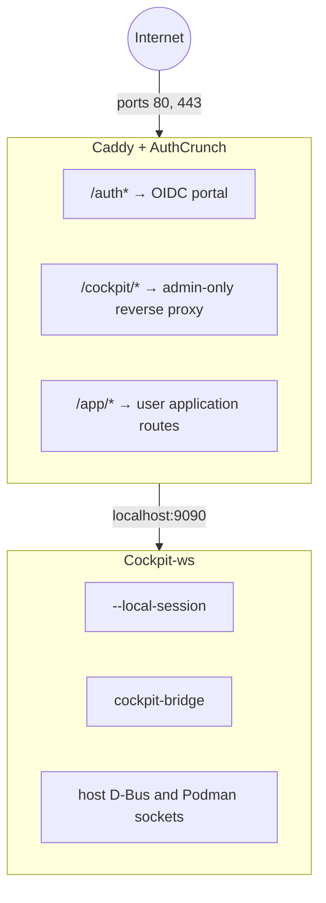

# OIDC-Authenticated Device Management

This tutorial builds an OIDC-authenticated management stack on AtomixOS using
three components:

- **Caddy with AuthCrunch** -- reverse proxy with Microsoft Entra OIDC login
  and JWT-based authorization
- **Cockpit-ws** -- browser-based device management console
- **Admin-only route policy** -- allows administrators to reach Cockpit while
  leaving room for user-facing application routes

The result is a single sign-on flow: users authenticate once through Entra ID,
and Caddy only exposes the Cockpit management console to admin users.

## Contents

<!-- toc -->

## Prerequisites

### Azure App Registration

1. In the Azure portal, open **Microsoft Entra ID** > **App registrations**
2. Select **New registration**
3. Set the redirect URI to:

   ```text
   https://<GATEWAY_DOMAIN>/auth/oauth2/azure/authorization-code-callback
   ```

4. Note the **Application (client) ID** and **Directory (tenant) ID**
5. Under **Certificates & secrets**, create a new client secret and copy its
   value
6. Under **Token configuration** > **Add groups claim**, select **Security
   groups**
7. Create two Entra security groups:
   - `AtomixOS-Admins` -- full device administration
   - `AtomixOS-Users` -- read-only monitoring access
8. Assign users to the appropriate groups

## Architecture



### Authentication Flow

1. User navigates to `https://<GATEWAY_DOMAIN>/cockpit/`
2. Caddy checks for a valid JWT cookie; if absent, redirects to `/auth/`
3. AuthCrunch initiates Entra OIDC login
4. After authentication, AuthCrunch maps Entra groups to roles:
   - `AtomixOS-Admins` group receives the `authp/admin` role
   - `AtomixOS-Users` group receives the `authp/user` role
5. AuthCrunch issues a JWT cookie with the mapped roles
6. Caddy validates the JWT and allows `/cockpit/*` only for `authp/admin`
7. Cockpit runs behind Caddy with `--local-session`; Cockpit performs no second
   login and relies on Caddy for authentication and authorization

## Bundle Structure

```text
example/caddy-oidc/
config.toml
files/
  caddy/
    Caddyfile
  cockpit/
    Containerfile
    cockpit.conf
```

Substitute the placeholder values, package this directory, and provision the
device.

## Placeholder Values

Replace these values before provisioning:

| Placeholder                | Where                   | Description                          |
|----------------------------|-------------------------|--------------------------------------|
| `<SSH_PUBLIC_KEY>`         | config.toml             | Your SSH public key for admin access |
| `<AZURE_TENANT_ID>`        | config.toml             | Entra directory (tenant) ID          |
| `<AZURE_CLIENT_ID>`        | config.toml             | App registration client ID           |
| `<AZURE_CLIENT_SECRET>`    | config.toml             | App registration client secret       |
| `<JWT_SHARED_KEY>`         | config.toml             | Shared HMAC-SHA256 signing key       |
| `<GATEWAY_DOMAIN>`         | Caddyfile, cockpit.conf | Public domain name of the device     |
| `<ENTRA_ADMIN_GROUP_NAME>` | Caddyfile               | Entra group name for admin role      |

Generate the JWT shared key with:

```bash
openssl rand -base64 32
```

## Configuration Files

### config.toml

The config defines two rootful containers, a network, a volume, and a build:

```toml
{{#include ../../../example/caddy-oidc/config.toml}}
```

Key points:

- Caddy is `privileged = true` because it binds ports 80/443
- Cockpit-ws is `privileged = true` because it runs a local management session
  with host D-Bus, systemd, journal, and Podman sockets mounted in
- The `cockpit-ws` container depends on its build service via `After`
- The `${FILES_DIR}` token is replaced at provision time with the path to
  the extracted bundle files
- The `management` network is defined for future use when containers move
  off host networking

### Caddyfile

```caddyfile
{{#include ../../../example/caddy-oidc/files/caddy/Caddyfile}}
```

Key points:

- The `order` directives register the authenticate and authorize handlers
- The identity provider block configures Entra OIDC via the `azure` driver
- The portal issues JWTs signed with the shared key
- `transform user` blocks assign base roles (`authp/user`) and promote
  admin group members to `authp/admin`
- `admin-policy` restricts `/cockpit/*` to `authp/admin`
- `user-policy` is provided for user-facing applications that should allow
  both `authp/admin` and `authp/user`

### cockpit.conf

```ini
{{#include ../../../example/caddy-oidc/files/cockpit/cockpit.conf}}
```

Key points:

- `AllowUnencrypted = true` because TLS terminates at Caddy
- `LoginTo = false` disables the host selector (single-device mode)
- `UrlRoot = /cockpit/` matches the Caddy route prefix

### Containerfile

```dockerfile
{{#include ../../../example/caddy-oidc/files/cockpit/Containerfile}}
```

The custom image adds Cockpit's bridge and management modules, then starts
cockpit-ws with `--local-session`. Cockpit itself does not authenticate users;
Caddy's admin-only OIDC policy protects the route.

## Building and Applying

Package the bundle as a tarball:

```bash
# Edit config.toml with your values
tar --zstd -cvf config.tar.zst -C <repo>/example/caddy-oidc .
```

Apply to the device using the bootstrap server or USB provisioning. See
[Provisioning](../provisioning.md) for details.

## Cockpit-Podman

The Cockpit Podman integration (`cockpit-podman`) lets operators manage
containers through the Cockpit UI. In this example it is installed into the
Cockpit container and uses the mounted host Podman socket at
`/run/podman/podman.sock`.

A future NixOS module could make Cockpit a native host service instead of a
containerized admin application:

```nix
{ pkgs, ... }:
{
  environment.systemPackages = [ pkgs.cockpit-podman ];
}
```

This is outside the scope of the tutorial config bundle and requires
rebuilding the AtomixOS base image.

## Security Considerations

This tutorial uses HS256 (symmetric) JWT signing for simplicity. For
production deployments:

- **Use asymmetric keys (RS256/ES256)** instead of a shared HMAC secret.
  AuthCrunch supports RSA and ECDSA key pairs.
- **Rotate secrets regularly.** The `JWT_SHARED_KEY` and Azure client secret
  should be rotated on a schedule.
- **Use secret files** instead of environment variables for sensitive values.
  Podman supports `--secret` mounts that avoid exposing secrets in Quadlet
  files on disk.
- **Pin image tags** in production. The tutorial uses `:latest` for
  convenience; production should pin to specific versions.
- **Restrict Cockpit access.** The `viewer` user should have minimal
  permissions. Consider using Cockpit's `cockpit.conf` `[Ssh-Login]`
  restrictions.
